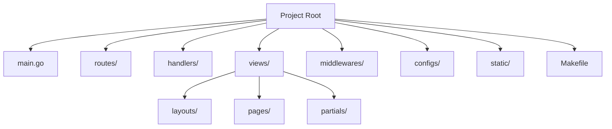
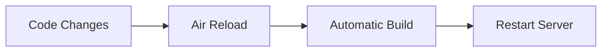
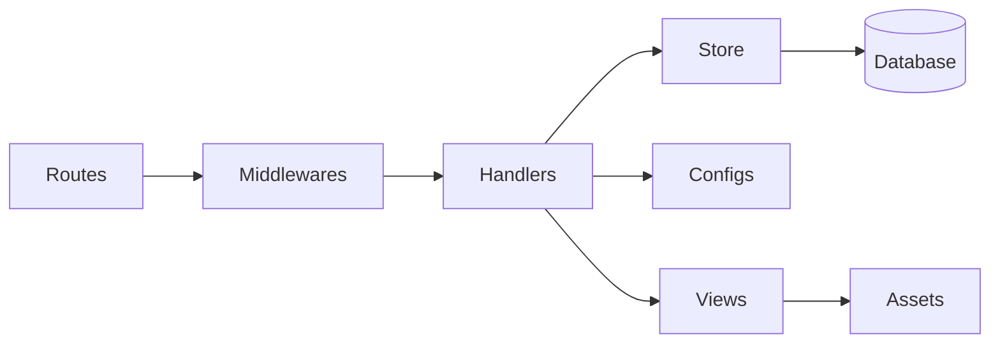

# Fiber Boilerplate with Air Hot Reloading

A production-ready GoFiber web application boilerplate following best practices from the .clinerules specification.

## Project Structure



## Features

- **Core Framework**: [Fiber](https://github.com/gofiber/fiber) - High performance HTTP framework
- **Development Tools**:
  - [Air](https://github.com/cosmtrek/air) - Hot reloading (.air.toml config)
  - Built-in Makefile workflow
  - dev.sh helper scripts
- **Authentication**:
  - Login/Register handlers
  - Session management
- **Admin Dashboard**:
  - Dedicated admin layout
  - Protected routes
- **Architecture**:
  - Route grouping and separation
  - Handler/store pattern for database abstraction
  - Custom middleware support
  - Configuration management (configs/)
  - Docker Swarm secrets support
- **Template Engine**:
  - Go's html/template integrated via Fiber adapter
  - Layouts (main.html, admin.html) and partials support
- **Static Assets**:
  - CSS framework integration (Bootstrap/Tailwind)
  - Organized in static/ directory
- **Operational**:
  - Health check endpoints (/livez, /readyz)
  - Metrics dashboard (/metrics)
  - Graceful shutdown

## Requirements

- Go 1.18+ (main language/runtime)
- Air (hot reloading for development)
- golangci-lint (code quality/linting)

#### How to install requirements (macOS)
```bash
brew install go
go install github.com/air-verse/air@latest
brew install golangci-lint
```

## Getting Started

### Installation

```bash
git clone https://github.com/tediscript/fiber-boilerplate.git
cd fiber-boilerplate
go mod download
```

### Development Workflow



Key commands:
```bash
make dev    # Run with hot reloading (uses Air)
make build  # Production build
make test   # Run tests
make lint   # Run linters
```

## Configuration

Configure via `.env` file:

| Variable          | Default            | Description                     |
|-------------------|--------------------|---------------------------------|
| PORT              | 3000               | Server port                    |
| APP_NAME          | "Fiber Boilerplate"| Application name               |
| SHUTDOWN_TIMEOUT  | 10                 | Graceful shutdown timeout (sec)|
| APP_SECRET        | (none)             | Application secret key         |

### Docker Swarm Secrets Support

Any environment variable can be loaded from a file using the `*_FILE` suffix pattern. This is useful for Docker Swarm secrets or any scenario where secrets are mounted as files:

```bash
# Instead of setting the value directly:
APP_SECRET=my-secret-key

# You can point to a file containing the secret:
APP_SECRET_FILE=/run/secrets/app_secret
```

The application will automatically read the file contents and use them as the variable value. This pattern works for any configuration variable.

## File Structure Details

```markdown
├── .gitignore
├── dev.sh              # Development utilities
├── go.mod
├── go.sum
├── main.go             # Main entry point
├── Makefile
├── README.md
├── template.html       # HTML template reference
├── configs/            # Configuration management
│   └── configs.go
├── handlers/           # HTTP handlers
│   ├── auth_handler.go
│   ├── dashboard_handler.go
│   └── home_handler.go
├── middlewares/        # Custom middleware
├── models/             # Data structures (placeholder)
├── routes/             # Route definitions
│   └── routes.go
├── static/             # Static assets
│   └── css/
│       └── styles.css
├── store/              # Database layer (placeholder)
└── views/              # Templates
    ├── layouts/
    │   ├── admin.html
    │   └── main.html
    ├── pages/
    │   ├── dashboard.html
    │   ├── home.html
    │   ├── login.html
    │   └── register.html
    └── partials/       # Reusable components
```

## Architecture Overview



### Key Patterns

1. **Route Definitions**:
   - Grouped by resource/functionality
   - Defined in `routes/` package
   - Clean separation from handlers

2. **Handler/Store Pattern**:
   - Handlers process HTTP requests
   - Store handles database operations
   - Clear separation of concerns

3. **Configuration Management**:
   - Centralized in configs/ package
   - Type-safe parsing via `caarlos0/env` library with struct tags
   - Docker Swarm secrets support (`*_FILE` pattern)

4. **Authentication Flow**:
   - Login/Register handlers
   - Session management
   - Protected routes

5. **Template Engine**:
   - Configured in `main.go`
   - Supports multiple layouts (`views/layouts/`)
   - Pages in `views/pages/`
   - Reusable partials (`views/partials/`)

## Code Standards

- Follows "Effective Go" idioms
- Strict error handling (never ignore errors)
- Linting via golangci-lint
- Formatted with go fmt
- Validation for all incoming data
- Configuration via .clinerules

## Air Configuration

Customize hot-reloading in `.air.toml`:

```toml
[build]
  delay = 1000               # Delay after changes (ms)
  include_ext = ["go", "html"] # Watched extensions
  exclude_dir = ["vendor"]   # Ignored directories
```

For full configuration options, see [Air documentation](https://github.com/cosmtrek/air).
