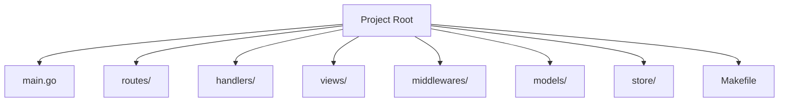
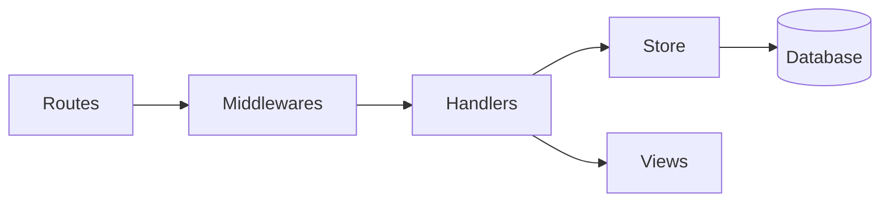

# Fiber Boilerplate with Air Hot Reloading

A production-ready GoFiber web application boilerplate following best practices from the .clinerules specification.

## Project Structure



## Features

- **Core Framework**: [Fiber](https://github.com/gofiber/fiber) - High performance HTTP framework
- **Development Tools**:
  - [Air](https://github.com/cosmtrek/air) - Hot reloading
  - Built-in Makefile workflow
- **Architecture**:
  - Route grouping and separation
  - Handler/store pattern for database abstraction
  - Custom middleware support
- **Template Engine**:
  - Go's html/template integrated via Fiber adapter
  - Layouts and partials support
- **Operational**:
  - Health check endpoints (/livez, /readyz)
  - Metrics dashboard (/metrics)
  - Graceful shutdown

## Requirements

- Go 1.18+
- Air (for development)
- golangci-lint (for code quality)

## Getting Started

### Installation

```bash
git clone https://github.com/yourusername/fiber-boilerplate.git
cd fiber-boilerplate
go mod download
```

### Development Workflow


Key commands:
```bash
make dev    # Run with hot reloading (uses Air)
make build  # Production build
make test   # Run tests
make lint   # Run linters
```

## Configuration

Configure via `.env` file:

| Variable          | Default            | Description                     |
|-------------------|--------------------|---------------------------------|
| PORT              | 3000               | Server port                    |
| APP_NAME          | "Fiber Boilerplate"| Application name               |
| SHUTDOWN_TIMEOUT  | 5                  | Graceful shutdown timeout (sec)|

## Architecture Overview



### Key Patterns

1. **Route Definitions**:
   - Grouped by resource/functionality
   - Defined in `routes/` package
   - Clean separation from handlers

2. **Handler/Store Pattern**:
   - Handlers process HTTP requests
   - Store handles database operations
   - Clear separation of concerns

3. **Template Engine**:
   - Configured in `main.go`
   - Supports layouts (`views/layouts/`)
   - Pages in `views/pages/`

## Code Standards

- Follows "Effective Go" idioms
- Strict error handling (never ignore errors)
- Linting via golangci-lint
- Formatted with go fmt
- Validation for all incoming data

## Air Configuration

Customize hot-reloading in `.air.toml`:

```toml
[build]
  delay = 1000               # Delay after changes (ms)
  include_ext = ["go", "html"] # Watched extensions
  exclude_dir = ["vendor"]   # Ignored directories
```

For full configuration options, see [Air documentation](https://github.com/cosmtrek/air).
